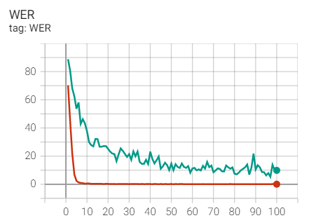
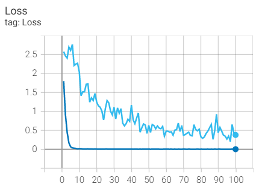
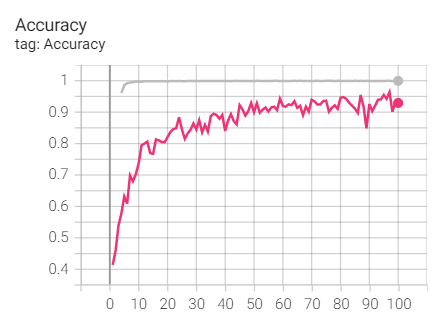

# Sign Language Recognition Based on PyTorch

#### Description
A neural network model with ResNet18 and LSTM as encoders and LSTM as decoders. The data set adopts the CSL continuous sign language data set of China University of Science and Technology. The highest accuracy rate Acc in the validation set was 96.37%, the lowest word error rate WER was 5.36%, and the lowest loss value was 0.2052.


#### Dataset Download

University of Science and Technology Sign Language Dataset:, Link: [SLR](https://pan.baidu.com/s/140JxG7tZ1VBbFkHw3NAeaQ?pwd=quad) . Extraction code: **quad**

Notes: only download "SLR_Dataset\\[连续句子]SLR_Dataset\color" and load in project "SLR-Final-Epoch100/datasets/CSL_Continuous/color".

#### Training Steps

```git
# Download project code
git clone https://gitee.com/zoujc2001/gesture-recognition.git

# Keyframe extraction of dataset video may take 2 hours
python cut_frame_more.py

# Start training
python CSL_Continuous_Seq2Seq.py
```


#### Training results

| Dataset        | Sentences | Samples | Best Test Wer | Best Test Loss | Acc    |
| -------------- | --------- | ------- | ------------- | -------------- | ------ |
| CSL_Continuous | 100       | 25,000  | 5.36%         | 0.2052         | 96.37% |







