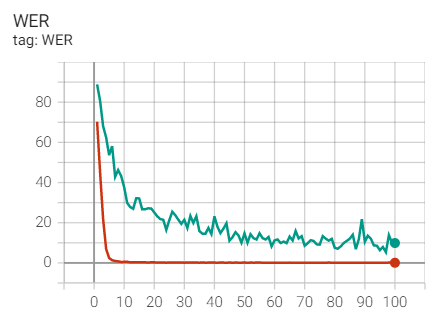
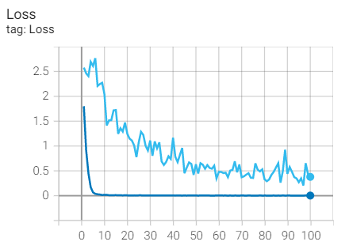
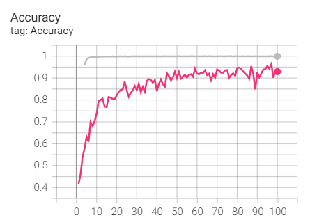

<<<<<<< HEAD
# Simple-Gesture-Translation
Simple Gesture Translation
=======
# 基于PyTorch的手语识别

#### 介绍
以ResNet18和LSTM为编码器，以LSTM为解码器的神经网络模型。数据集采用中科大CSL连续手语数据集。验证集中最高准确率Acc为96.37%、最低错词率WER为5.36%、最低损失值为0.2052。

#### 文件夹创建
在项目datasers/CSL_Continuous/文件夹下创建两个空文件夹分别命名为color和picture。

#### 数据集下载

中科大手语数据集：链接：[SLR数据集](https://pan.baidu.com/s/140JxG7tZ1VBbFkHw3NAeaQ?pwd=quad) 。提取码：**quad** 

注：本项目只需下载SLR数据集中的SLR_Dataset/[连续句子]SLR_Dataset/color文件夹内的100个文件，大小为55GB左右，并将其放入本项目SLR-Final-Epoch100/datasets/CSL_Continuous/color文件夹下。


#### 训练步骤

```git
# 下载项目代码
git clone https://gitee.com/zoujc2001/gesture-recognition.git

# 对数据集视频进行关键帧提取，可能需要耗时2小时
python cut_frame_more.py

# 开始训练
python CSL_Continuous_Seq2Seq.py
```


#### 训练结果

| Dataset        | Sentences | Samples | Best Test Wer | Best Test Loss | Acc    |
| -------------- | --------- | ------- | ------------- | -------------- | ------ |
| CSL_Continuous | 100       | 25,000  | 5.36%         | 0.2052         | 96.37% |






>>>>>>> 1cfcb36 (20240101)
